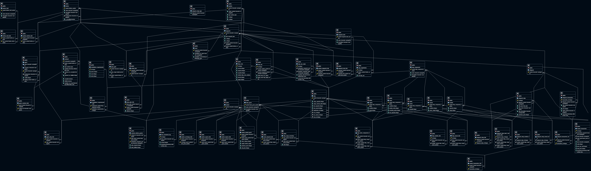

# A database for Space Traders

## Description
This project contains code for creating a postgres database and flask application to interact with it. Once the database is created, run the flask application to populate it with data from the Space Traders API. The web app also has some pages to display some of the data in the database. The flask app follows Model View Controller (MVC) design pattern

## Installation
1. Clone this repository
2. Create a virtual environment
3. Install the requirements: `pip install -r requirements.txt`
4. Create a postgres database
5. Create the tables with the `sql/create_tables.sql` file
6. Modify the `config.ini` with your database credentials: `postgresql://<username>:<password>@localhost/<database_name>`

## Usage
1. Run the flask application: `flask --app run run`
2. Go to `localhost:5000` in your browser
3. On the home page, you can either create a new agent, or add your existing agent to the database. The first time you do this it will take around 5 min to populate the database with the faction data from the Space Traders API. After that, it will only take a few seconds to new agents.
4. On the universe page, the `populate Faction tables` button will populate the database with the faction data from the Space Traders API. This will take around 5 min. The `add jump gates` will add all the systems linked by jump gates currently in the database. This could take a long time. The `Populate Systems` button will start retrieving the data for **all of the systems** from the Space Traders API. This will take a very long time to complete, so feel free to interrupt it at any time.

## Database
The schema for the database:

